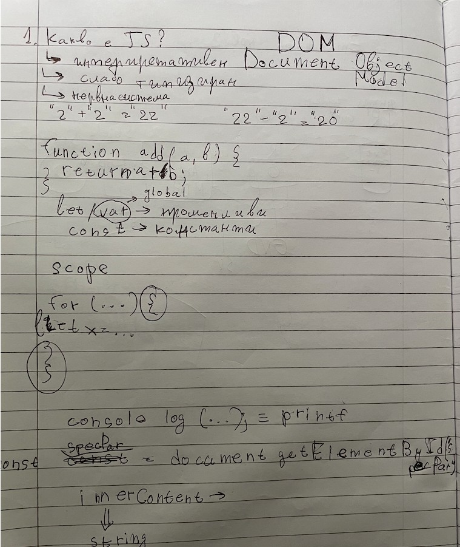

# JavaScript vs C: Основни разлики за начинаещи

Кратък наръчник за ученици в 8 клас в ТУЕС София, които искат да разберат какво е специфичното в JavaScript и как се различава от C.

## Ръкописни бележки от час

Снимка от тетрадката с основни идеи (интерпретатор, типове, **DOM** — *Document Object Model*, примери за *coercion*, `let`/`var`/`const`, *scope*, `console.log` ≈ `printf`, избор на елемент с `getElementById`).



---

## 1. Какво е JavaScript (JS)?

**JavaScript** е език за програмиране, който първоначално е създаден, за да прави уеб страниците **интерактивни**. Днес се използва навсякъде — в браузъри, сървъри, мобилни приложения.

**Основни характеристики:**

| Характеристика | Какво означава |
|----------------|----------------|
| **Интерпретиран** | Кодът се изпълнява ред по ред, без предварително компилиране |
| **Динамично типизиран** | Не декларираш типовете на променливите (не пишеш `int`, `char`) |
| **Високо ниво** | Абстрахира се от детайлите на хардуера и паметта |
| **Мултипарадигмен** | Поддържа различни стилове: процедурен, обектно-ориентиран, функционален |

**В час често се казва „слабо типизиран“ (*weakly typed*).** Това върви заедно с **динамичните типове**: типът на стойността може да се сменя, а при много операции JavaScript **сам превръща** типовете (виж **1б**). Това улеснява писането, но изисква внимание — резултатът понякога изненадва.

**Метафора от бележките („нервна система“):** **HTML** дава **структурата** на страницата, **CSS** — **външния вид**, а **JavaScript** е като **нервната система** — прави страницата **интерактивна** (реакции на клик, смяна на текст, проверки). Работата с **DOM** (*Document Object Model*) е начинът, по който скриптът „докосва“ елементите от HTML.

---

## 1а. От часа: `console.log` и `printf`

В C за извеждане към конзолата се ползва **`printf`** (от `<stdio.h>`). В JavaScript в браузъра и в **Node.js** най-често се ползва **`console.log(...)`** — **същата идея**: показваш стойности, за да провериш какво прави програмата.

```javascript
console.log("Здравей", 42, true);  // няколко стойности, разделени с интервал
```

За разлика от `printf`, **няма спецификатори** като `%d` — можеш да подадеш директно изрази или да ползваш шаблонен низ: `` `a = ${a}` ``.

---

## 1б. Привеждане на типове (*type coercion*) — примерите от тетрадката

Когато операторът очаква определен тип, JavaScript често **преобразува** низове и числа „сам“.

| Израз | Резултат | Защо |
|-------|----------|------|
| `"2" + "2"` | `"22"` | Операторът `+` между **низове** е **слепване** (*concatenation*), не събиране. |
| `"22" - "2"` | `20` | Операторът `-` работи с **числа**; двата низа се третират като числа, ако изглеждат като такива. |

```javascript
console.log("2" + "2");   // "22"
console.log("22" - "2");  // 20  (число, не низ!)
```

**Сравнение с C:** В C няма такова „магическо“ поведение за `"2" + "2"` като събиране на низове по същия начин; там типовете са строги и се ползват функции като `sprintf` / конкатенация с буфери.

**Съвет:** За **надеждни сравнения** в JS в час ще учите и **`===`** (строго равенство), за да избегнеш неочаквани приведения.

---

## 1в. Променливи: `let`, `var`, `const` и *scope* (област на видимост)

От бележките: **`let`** и **`var`** — **променливи**; **`const`** — **константа** (не можеш да пренасочиш името към друга стойност).

| Ключова дума | Накратко |
|----------------|----------|
| **`let`** | Променлива с **блокова** област — вижда се само вътре в `{ ... }`, където е декларирана. **Препоръчва се** в съвременен код. |
| **`var`** | По-стар начин; поведението с областта е друго (често „изглежда“ **глобално** или цяла функция). В час е споменато като връзка към **global** — за нови задачи по-добре **`let`**. |
| **`const`** | Константна **връзка** към стойност; за обекти/масиви **съдържанието** може да се променя, но не и самото присвояване `const x = ...`. |

**Block scope** (както около `for` в тетрадката): променлива, декларирана с **`let` вътре в `{ }`**, **не съществува** извън тези скоби.

```javascript
for (let i = 0; i < 3; i++) {
    let x = i * 10;   // x е само за този блок (всяка итерация има свой x)
    console.log(x);
}
// console.log(x);  // грешка — x няма смисъл тук
```

В C близката идея е, че променлива, декларирана в блок `{ }`, също изчезва след блока (от **C99** с `for (int i = ...)` е същият дух).

**Функция от бележките:**

```javascript
function add(a, b) {
    return a + b;
}
```

---

## 2. Сравнение: JavaScript vs C

| Аспект | C | JavaScript |
|--------|---|------------|
| **Типове** | Статични (`int`, `char`, `float`) — декларираш предварително | Динамични — типът се определя автоматично |
| **Памет** | Ръчно управление (много важно!) | Автоматично управление ( Garbage Collector ) |
| **Компилация** | Компилира се преди изпълнение | Интерпретира се директно |
| **Платформа** | Работи навсякъде (нативен код) | Първоначално само в браузър, сега и на сървър (Node.js) |
| **Скорост** | Много бърз (близо до хардуера) | По-бавен, но достатъчно бърз за повечето задачи |
| **Сложност** | По-сложен за начинаещи | По-лесен за начало |
| **Указатели** | Има (`*`, `&`) — мощни, но опасни | Няма директни указатели |
| **Низове** | Масив от `char` с `\0` | Готов тип `string` с методи |

---

## 3. Примери: едно и също нещо на C и JS

### 3.1. Променливи и извеждане

**C:**
```c
#include <stdio.h>

int main(void) {
    int age = 15;
    char name[] = "Иван";
    float grade = 5.50;
    
    printf("Здравей, %s! Ти си на %d години.\n", name, age);
    printf("Оценка: %.2f\n", grade);
    
    return 0;
}
```

**JavaScript:**
```javascript
let age = 15;
let name = "Иван";
let grade = 5.50;

console.log(`Здравей, ${name}! Ти си на ${age} години.`);
console.log("Оценка: " + grade.toFixed(2));
```

**Ключови разлики:**
- В C декларираш типа (`int`, `char[]`, `float`)
- В JS просто пишеш `let` — типът се разбира автоматично
- В C ползваш `printf` със спецификатори (`%s`, `%d`, `%.2f`)
- В JS ползваш `console.log` и шаблонни низове (`` `...${...}` ``)

---

### 3.2. Условия (if-else)

**C:**
```c
int score = 85;

if (score >= 90) {
    printf("Отличен 6\n");
} else if (score >= 75) {
    printf("Много добър 5\n");
} else if (score >= 60) {
    printf("Добър 4\n");
} else {
    printf("Трябва да учиш повече\n");
}
```

**JavaScript:**
```javascript
let score = 85;

if (score >= 90) {
    console.log("Отличен 6");
} else if (score >= 75) {
    console.log("Много добър 5");
} else if (score >= 60) {
    console.log("Добър 4");
} else {
    console.log("Трябва да учиш повече");
}
```

**Ключова разлика:** Синтаксисът е почти същият, но в JS не пишеш типа при деклариране на `score`.

---

### 3.3. Цикли

**C (for цикъл):**
```c
for (int i = 1; i <= 5; i++) {
    printf("Крачка %d\n", i);
}
```

**JavaScript (for цикъл):**
```javascript
for (let i = 1; i <= 5; i++) {
    console.log("Крачка " + i);
}
```

**JavaScript (for-of за масиви):**
```javascript
let fruits = ["ябълка", "банан", "портокал"];

for (let fruit of fruits) {
    console.log(fruit);
}
```

---

### 3.4. Масиви

**C (фиксиран размер):**
```c
int grades[5] = {5, 4, 6, 5, 6};

for (int i = 0; i < 5; i++) {
    printf("Оценка %d: %d\n", i + 1, grades[i]);
}
```

**JavaScript (динамичен масив):**
```javascript
let grades = [5, 4, 6, 5, 6];

// Можеш да добавяш елементи по всяко време
grades.push(5);
grades.push(6);

for (let i = 0; i < grades.length; i++) {
    console.log(`Оценка ${i + 1}: ${grades[i]}`);
}

// Или още по-лесно:
grades.forEach((grade, index) => {
    console.log(`Оценка ${index + 1}: ${grade}`);
});
```

**Ключови разлики:**
- В C масивът има фиксиран размер — декларираш го предварително
- В JS масивът е динамичен — можеш да добавяш/махаш елементи по всяко време
- В JS масивите имат вградени методи (`push`, `pop`, `forEach`, `map`)

---

### 3.5. Функции

**C:**
```c
#include <stdio.h>

// Декларираш типа на параметрите и връщаната стойност
float calculateAverage(int a, int b) {
    return (a + b) / 2.0;
}

int main(void) {
    float result = calculateAverage(5, 6);
    printf("Средна оценка: %.2f\n", result);
    return 0;
}
```

**JavaScript:**
```javascript
// Не декларираш типове
function calculateAverage(a, b) {
    return (a + b) / 2;
}

// Или със стрелкова функция (по-модерен синтаксис)
const calculateAverageArrow = (a, b) => (a + b) / 2;

let result = calculateAverage(5, 6);
console.log("Средна оценка: " + result.toFixed(2));
```

---

## 4. Какво е специфичното в JavaScript?

### 4.1. Обекти (Objects)

JavaScript има вградена поддръжка за обекти — структури, които групират данни и функции.

```javascript
let student = {
    name: "Георги",
    age: 15,
    class: "8А",
    grades: [6, 5, 6, 4, 6],
    
    // Метод (функция в обекта)
    getAverage: function() {
        let sum = this.grades.reduce((a, b) => a + b, 0);
        return sum / this.grades.length;
    }
};

console.log(student.name);              // Георги
console.log(student.getAverage());      // 5.4
```

### 4.2. Асинхронно програмиране

JavaScript може да изпълнява операции "във фона", без да блокира програмата.

```javascript
// Симулираме изчакване (например заявка към сървър)
console.log("Започвам...");

setTimeout(() => {
    console.log("Готово след 2 секунди!");
}, 2000);

console.log("Продължавам веднага, без да чакам!");

// Изход:
// Започвам...
// Продължавам веднага, без да чакам!
// (след 2 секунди) Готово след 2 секунди!
```

### 4.3. DOM манипулация (само в браузъра)

**DOM** (*Document Object Model*) е дървото от обекти, което браузърът създава от HTML — всеки таг става „възел“, до който JavaScript стига чрез **`document`**.

**Както в час (избор по `id`):** в HTML трябва да има нещо като `<p id="perPar">...</p>`. В скрипта:

```javascript
const specPar = document.getElementById("perPar");
// specPar е обект (или null, ако няма такъв id)
```

**Съдържание като низ:** текстът вътре в елемента се чете и задава като **низ** — в бележките е отбелязано към **string**. На практика се ползва:

- **`element.textContent`** — само текст (по-безопасно при потребителски данни);
- **`element.innerHTML`** — низ с HTML вътре; удобно, но **опасно**, ако низът идва от потребител (риск от **XSS** — *Cross-Site Scripting*, вмъкване на злонамерен скрипт).

```javascript
const heading = document.getElementById("title");
heading.textContent = "Нов заглавие!";   // нормален текст

heading.classList.add("highlight");      // CSS клас към същия елемент
```

---

## 5. Кога какво да учиш?

| Ако искаш... | Започни с... |
|--------------|--------------|
| Да разбереш как работи компютърът "отвътре" | **C** — учи за памет, указатели, битове |
| Бързо да направиш интерактивен уеб сайт | **JavaScript** — веднага виждаш резултат в браузъра |
| Да програмираш микроконтролери | **C** — по-близо до хардуера |
| Да създадеш мобилно приложение | **JavaScript** (с React Native) или друг език |
| Да разбереш основите на програмирането | **И двата!** — C за структура, JS за бързи резултати |

---

## 6. Чести обърквания при преход от C към JS

| Объркване | В C | В JavaScript |
|-----------|-----|--------------|
| **Размер на масив** | `sizeof(array) / sizeof(array[0])` | `array.length` |
| **Сравнение на низове** | `strcmp(a, b) == 0` | `a === b` |
| **Конкатенация** | `strcat` (опасна!) или `snprintf` | `a + b` или `` `${a}${b}` `` |
| **Въвеждане** | `scanf`, `fgets` | `prompt()` в браузъра или `readline` в Node.js |
| **Извеждане** | `printf` | `console.log` (същата роля за „покажи ми стойността“) |
| **Слабо типизиране / coercion** | Малко автоматични преобразувания между низ и число в I/O | Често при `+`, `-`, `==` — внимавай с низове и числа |

---

## 7. Кратък речник на съкращения и термини

- **JS (JavaScript)** — скриптов език за уеб и сървъри; първоначално създаден за интерактивност в браузъри.
- **HTML (HyperText Markup Language)** — език с тагове за структура на уеб страница (заглавия, параграфи, връзки).
- **CSS (Cascading Style Sheets)** — стилове (цветове, шрифтове, подредба) върху HTML.
- **DOM (Document Object Model)** — дървовидно представяне на HTML документа; JavaScript манипулира DOM, за да променя страницата.
- **Weak typing (слабо типизиране)** — в разговор за JS: типовете не са фиксирани върху променливата и често има **автоматични приведения**; внимавай с `+` и низове.
- **Type coercion (привеждане / принудително преобразуване на тип)** — когато JavaScript автоматично превърне стойност от един тип в друг за дадена операция (напр. `"2" + "2"` → низ `"22"`; `"22" - "2"` → число `20`).
- **Scope (област на видимост)** — къде в кода „виждаш“ променлива; с `let`/`const` вътре в `{ }` променливата е само за този блок (както в бележките с `for { let x ... }`).
- **Global (глобална област)** — най-външното ниво на програмата; променливи с **`var`** в стари примери често се държат „широко“ видими — затова в час се отбелязва връзката към global; за нов код **`let`** / **`const`**.
- **Concatenation (конкатенация / слепване на низове)** — слепване на два низа един след друг; при `"2" + "2"` операторът `+` прави точно това.
- **`textContent`** — свойство на DOM елемент: текстът вътре като низ, без интерпретация на HTML тагове.
- **`innerHTML`** — свойство на DOM елемент: низ с HTML; при задаване от ненадежден източник може да доведе до **XSS (*Cross-Site Scripting*)** — изпълнение на чужд скрипт в страницата; за учебни задачи с фиксиран текст е ок, за реални данни — предпочитай `textContent` или санитизация.
- **API (Application Programming Interface)** — интерфейс за програмиране; начин, по който програми "разговарят" помежду си.
- **JSON (JavaScript Object Notation)** — текстов формат за обмен на данни; лесен за четене от хора и машини.
- **HTTP (HyperText Transfer Protocol)** — протокол за пренос на данни в интернет; основа на уеб комуникацията.
- **Garbage Collector (GC)** — автоматично почистване на неизползвана памет в JavaScript; в C трябва ръчно да управляваш паметта.
- **Callback** — функция, която се изпълнява по-късно, когато някаква операция приключи; основа на асинхронното програмиране в JS.
- **Event (събитие)** — действие (клик, натискане на клавиш), на което JavaScript може да реагира.
- **Node.js** — среда за изпълнение на JavaScript извън браузъра; позволява JS на сървъри.
- **Frontend** — частта от уеб приложението, която се вижда в браузъра; обикновено писана на JavaScript.
- **Backend** — сървърната част на приложение; може да е на JavaScript (Node.js), C, Python и др.
- **ТUES (Технологично училище "Електронни системи")** — технологично училище в София, където се изучават програмиране и електроника.
- **ТУЕС** — съкратено наименование на Технологично училище "Електронни системи" към Технически университет — София.

---

## 8. Заключение

| | C | JavaScript |
|---|---|------------|
| **Учи го, ако...** | Искаш дълбоко разбиране на компютрите | Искаш бързо да видиш резултати |
| **Трудност** | По-сложен в началото | По-лесен за старт |
| **Контрол** | Пълен контрол над паметта | Автоматично управление |
| **Приложение** | Системен софтуер, вградени системи | Уеб, мобилни приложения, сървъри |

**За ученик в ТУЕС:** Започни с **C**, за да изградиш солидна основа за памет, типове и структура на програмите. След това JavaScript ще ти се стори много лесен и интуитивен!

---

*Документът е създаден специално за ученици в 8 клас в ТУЕС София.*
