# Решения на задачи с блок-схеми

## 📺 Уроци за блок-схеми

**Видео уроци:** [Плейлист с уроци за блок-схеми](https://www.youtube.com/playlist?list=PLQu8_cLxLGhSVXzKPpifIf0n74oiN_ZnE)

---

## Легенда на променливите

- **a, b, c**: входни числа; при задачи 19–20 са коефициенти в линейно уравнение/неравенство.
- **x**: неизвестна величина (решение на уравнение/граница в неравенство).
- **n**: брой елементи (колко числа ще въведем) или естествено число за задачи със цифри/делители; когато пише „Въведи n“, това означава „задай броя“ или „въведи самото число n“ според контекста на задачата:
  - при задачи 3, 5–7: n е брой числа, които ще се въвеждат последователно;
  - при задачи 4: n е горната граница на сумата 1..n (и се валидира да е естествено число);
  - при задачи 8–14: n е самото естествено число, върху чиито цифри работим;
  - при задачи 15–17: n е числото, за което търсим делители/простота/прости делители;
  - при задача 18: n е степента (цяло число, може и отрицателно).
- **i**: брояч в цикъл (стартира от 1 или 2 според задачата).
- **sum**: акумулатор за сума.
- **temp**: временна променлива (буфер) при размяна.
- **max, maxDigit**: текущ максимум (между числа/цифри).
- **m**: конструирано число (напр. от обърнати/четни цифри на n).
- **digit**: текуща последна цифра на n (n % 10).
- **count**: брояч (брой елементи/делители/съвпадения на цифра).
- **found**: булев флаг за „намерено“ (true/false).
- **isPrime**: булев флаг дали числото е просто.
- **result**: резултат при степенуване (a^n).
- **base**: текуща база при бързо степенуване (квадратиране).
- **absN**: абсолютна стойност на степента при n < 0.
- **multiplier**: позиционен множител за изграждане на m (1, 10, 100, ...).
- **граница**: гранична стойност −b/a при неравенства.

## Легенда на блок-схемите (градивни блокове)

- Начало/Край (овал): обозначава старт и край на алгоритъма; в схемите е „Старт“ и „Край“.
- Процес/Дейност (правоъгълник): стъпка от обработката, напр. присвояване, изчисление, актуализация на променлива.
- Вход/Изход (паралелограм): въвеждане от потребителя или извеждане на резултат, напр. „Въведи n“, „Изведи sum“.
- Условие/Решение (ромб): логическа проверка с изходи „Да/Не“ (true/false), които разклоняват потока.
- Подпрограма/Предефиниран процес (двоен правоъгълник): извикване на отделна процедура/функция, напр. `IsPrime(p)`.
- Съединител (малък кръг/континуатор): прехвърля потока между отдалечени места на една страница при по-големи схеми.
- Междусуседност/Off-page съединител (пентагон): свързва с продължение на друга страница (рядко нужно тук).
- Поток/Стрелка: посока на изпълнение между блоковете; при условия се етикетира с „Да/Не“.
- Коментар/Бележка: допълнителна пояснителна информация към стъпка; не влияе на потока.

### Визуализации на градивните блокове

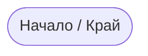

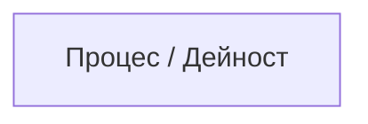

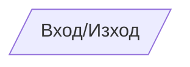

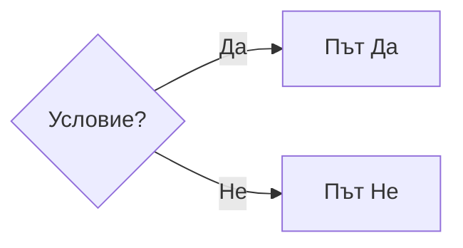

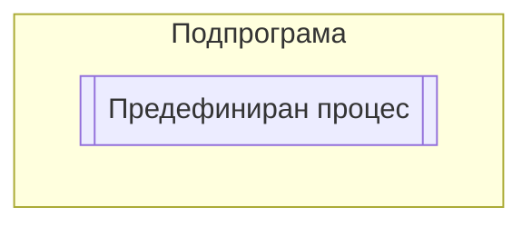

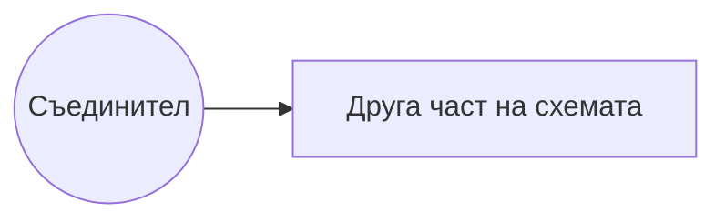

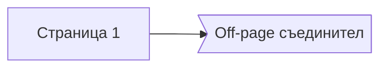

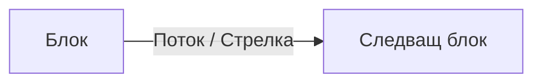

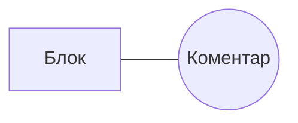

### Математически термини (пояснения)

- **естествено число**: положително цяло число 1, 2, 3, ... (понякога и 0 – тук приемаме n ≥ 1, освен ако изрично не е казано друго).
- **делимост**: казваме, че `n` се дели на `d`, ако остатъкът при деление е 0, т.е. `n % d == 0`.
- **делител** на `n`: всяко цяло `d`, за което `n % d == 0`.
- **прост делител**: делител, който сам по себе си е просто число (например за 12 простите делители са 2 и 3).
- **просто число**: цяло число `n ≥ 2`, което има точно два делителя: 1 и `n`.
- **съставно число**: цяло число `n ≥ 2`, което НЕ е просто (има поне един делител, различен от 1 и `n`).
- **остатък при деление**: `n % d` – числото, което остава след делението на `n` на `d`.
- **квадратен корен (√n)**: число `r`, за което `r * r = n`; при проверка за простота е достатъчно да търсим делители до `i * i ≤ n` (т.е. до √n).

## Задача 1: Размяна стойностите на две променливи

### Начин 1: С трета променлива (буфер)

**Обяснение:** Използваме трета променлива като временно хранилище за стойността на една от променливите.

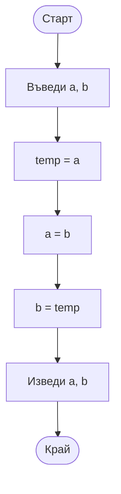

**Псевдокод:**
```
1. Въведи a, b
2. temp = a
3. a = b
4. b = temp
5. Изведи a, b
```

### Начин 2: С аритметични операции (+,-)

**Обяснение:** Използваме свойството, че a + b - b = a, за да разменим стойностите без трета променлива.

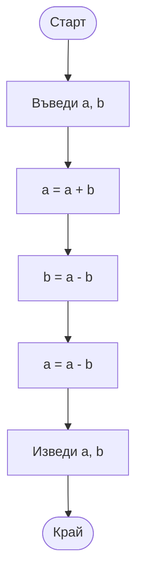

**Псевдокод:**
```
1. Въведи a, b
2. a = a + b
3. b = a - b
4. a = a - b
5. Изведи a, b
```

---

## Задача 2: Максимум от 3 числа

### Начин 1: С вложени условни блокове (пълна форма)

**Обяснение:** Използваме вложени if-else блокове, за да проверяваме всички възможности.

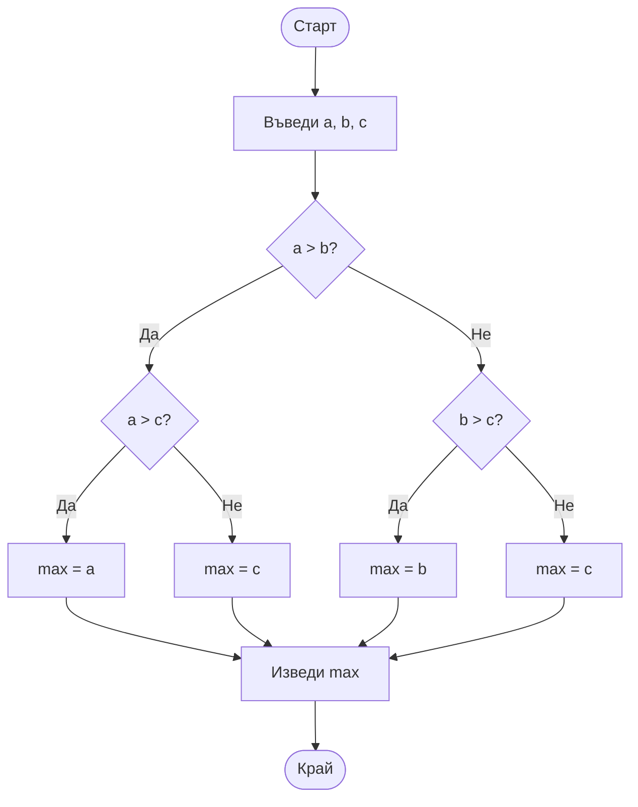

**Псевдокод:**
```
1. Въведи a, b, c
2. Ако a > b, тогава
     2.1. Ако a > c, тогава max = a
           Иначе max = c
   Иначе
     2.2. Ако b > c, тогава max = b
           Иначе max = c
3. Изведи max
```

### Начин 2: С непълна форма (if без else)

**Обяснение:** Използваме само if блокове, като последователно проверяваме и обновяваме максимума.

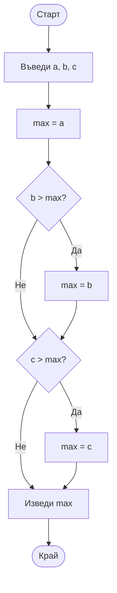

**Псевдокод:**
```
1. Въведи a, b, c
2. max = a
3. Ако b > max, тогава max = b
4. Ако c > max, тогава max = c
5. Изведи max
```

---

## Задача 3: Максимум от n числа

### Начин 1: С цикъл с предусловие (while)

**Обяснение:** Използваме цикъл с предусловие, защото трябва да проверим брояч преди влизане в цикъла. Това е подходящо, защото ако n=0, не трябва да правим нищо.

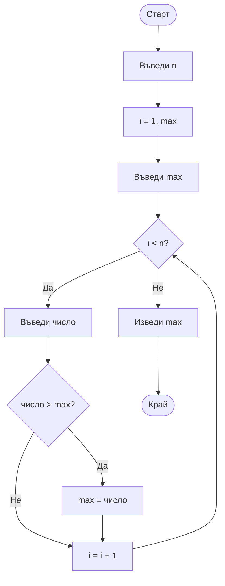

**Псевдокод:**
```
1. Въведи n
2. i = 1
3. Въведи max (първото число)
4. Докато i < n, повтаряй:
     4.1. Въведи число
     4.2. Ако число > max, тогава max = число
     4.3. i = i + 1
5. Изведи max
```

**Защо НЕ е подходящ цикъл с постусловие?**
При цикъл с постусловие (do-while) винаги изпълняваме цикъла поне веднъж. Ако n=0, все пак ще се изпълни и ще се опита да въведем число. При n=0 трябва да излезем веднага, затова е по-подходящ цикъл с предусловие.

### Начин 2: С цикъл с постусловие (за сравнение)

**Обяснение:** Въпреки че не е идеален за тази задача, ето как би изглеждал с do-while. Трябва да внимаваме с n=0.

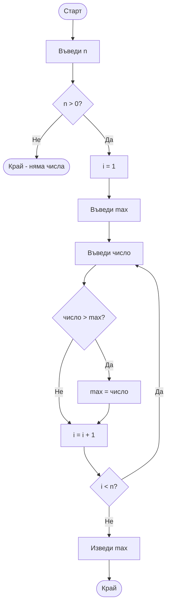

---

## Задача 4: Сумата на числата от 1 до n

### С цикъл с предусловие (while)

**Обяснение:** Използваме цикъл с предусловие за намиране на сумата 1+2+...+n. Преди това валидираме n с цикъл с постусловие.

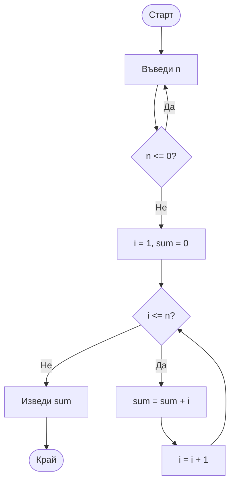

**Псевдокод:**
```
1. Повтаряй:
     1.1. Въведи n
   Докато n <= 0
2. i = 1
3. sum = 0
4. Докато i <= n, повтаряй:
     4.1. sum = sum + i
     4.2. i = i + 1
5. Изведи sum
```

### С цикъл с постусловие (do-while) за валидиране

**Обяснение:** За валидиране на входните данни (n да е естествено число) използваме do-while, защото винаги искаме да попитаме поне веднъж.

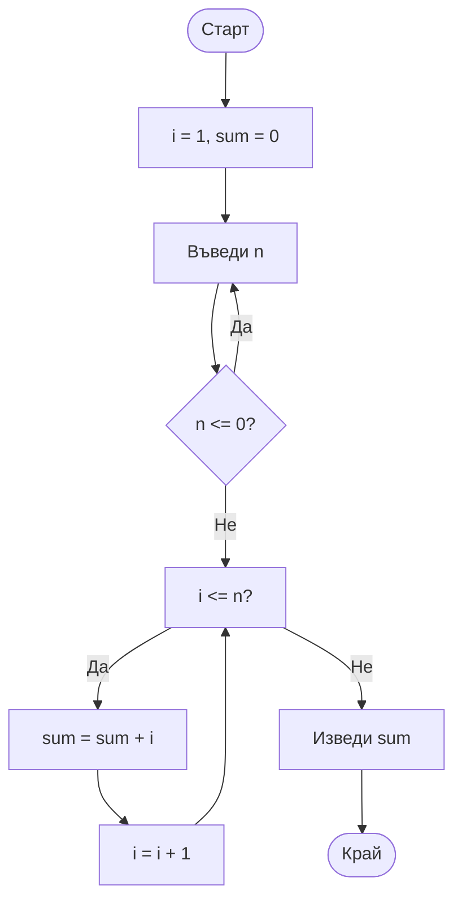

---

## Задача 5: Сумата на n произволни числа

**Обяснение:** Въвеждаме n числа и намираме тяхната сума.

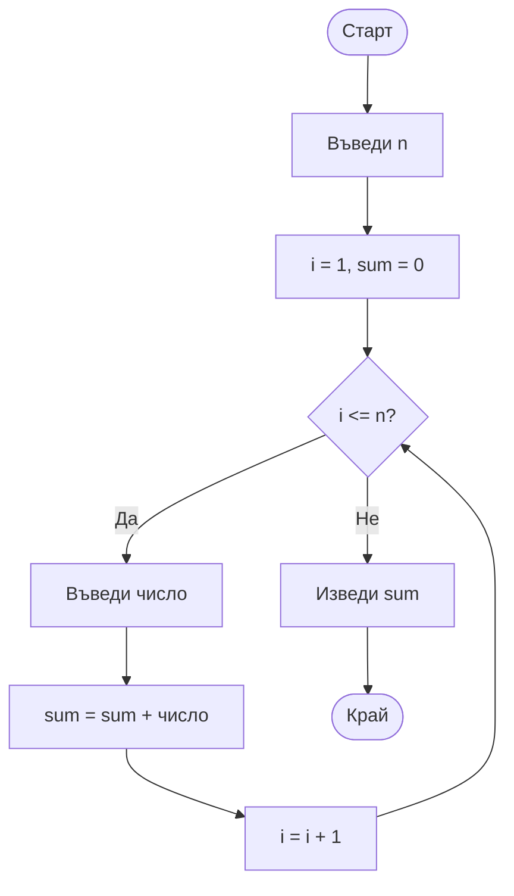

**Псевдокод:**
```
1. Въведи n
2. i = 1
3. sum = 0
4. Докато i <= n, повтаряй:
     4.1. Въведи число
     4.2. sum = sum + число
     4.3. i = i + 1
5. Изведи sum
```

---

## Задача 6: Среден успех на учениците от класа

**Обяснение:** Въвеждаме оценките на всички ученици и намираме средното аритметично.

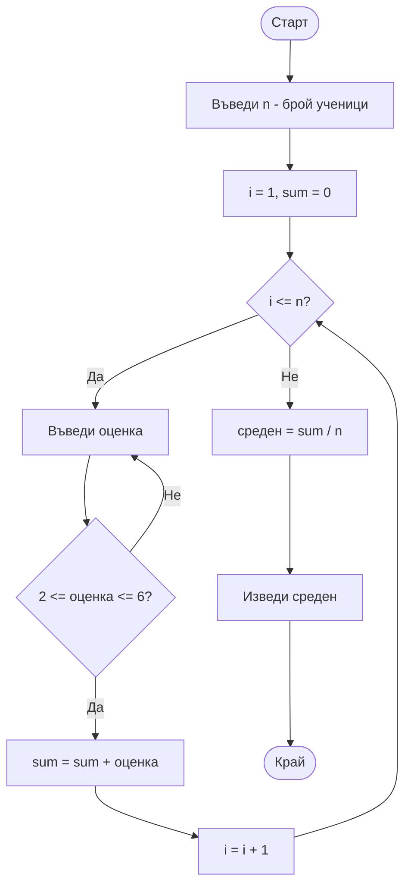

**Псевдокод:**
```
1. Въведи n
2. i = 1
3. sum = 0
4. Докато i <= n, повтаряй:
     4.1. Повтаряй:
             4.1.1. Въведи оценка
          Докато оценка < 2 ИЛИ оценка > 6
     4.2. sum = sum + оценка
     4.3. i = i + 1
5. среден = sum / n
6. Изведи среден
```

---

## Задача 7: Максимум от n цели числа, но само тези, които се делят на 3

**Обяснение:** Намираме максималното число сред тези, които се делят на 3. Ако няма такива, трябва да обработим този случай.

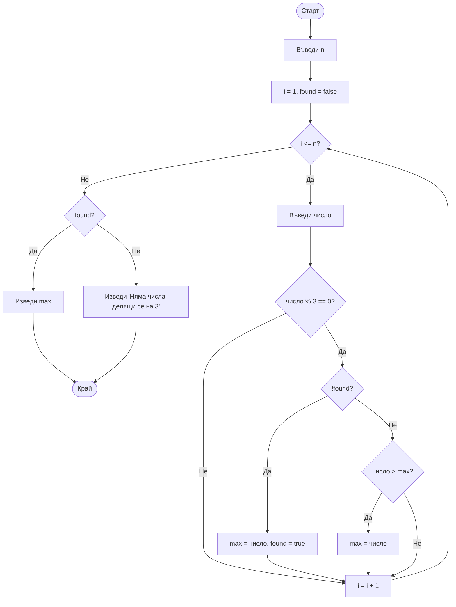

**Псевдокод:**
```
1. Въведи n
2. i = 1
3. found = false
4. Докато i <= n, повтаряй:
     4.1. Въведи число
     4.2. Ако число % 3 == 0, тогава
             4.2.1. Ако !found, тогава
                         max = число
                         found = true
                     Иначе
                         Ако число > max, тогава max = число
     4.3. i = i + 1
5. Ако found, тогава изведи max
   Иначе изведи "Няма числа делящи се на 3"
```

---

## Задача 8: Брой на цифрите в естествено число

**Обяснение:** Намираме броя на цифрите в дадено число чрез последователно деление на 10.

```mermaid
flowchart TD
    Start([Старт]) --> Input[Въведи n]
    Input --> Validate{n <= 0?}
    Validate -->|Да| Input
    Validate -->|Не| Init[count = 0]
    Init --> Check{n > 0?}
    Check -->|Не| Output[Изведи count]
    Check -->|Да| Count[count = count + 1]
    Count --> Divide[n = n / 10]
    Divide --> Check
    Output --> End([Край])
```

**Псевдокод:**
```
1. Повтаряй:
     1.1. Въведи n
   Докато n <= 0
2. count = 0
3. Докато n > 0, повтаряй:
     3.1. count = count + 1
     3.2. n = n / 10 (целочислено деление)
4. Изведи count
```

---

## Задача 9: Сума на цифрите в естествено число

**Обяснение:** Намираме сумата на всички цифри в дадено число.

```mermaid
flowchart TD
    Start([Старт]) --> Input[Въведи n]
    Input --> Validate{n <= 0?}
    Validate -->|Да| Input
    Validate -->|Не| Init[sum = 0]
    Init --> Check{n > 0?}
    Check -->|Не| Output[Изведи sum]
    Check -->|Да| Digit[digit = n % 10]
    Digit --> Add[sum = sum + digit]
    Add --> Divide[n = n / 10]
    Divide --> Check
    Output --> End([Край])
```

**Псевдокод:**
```
1. Повтаряй:
     1.1. Въведи n
   Докато n <= 0
2. sum = 0
3. Докато n > 0, повтаряй:
     3.1. digit = n % 10
     3.2. sum = sum + digit
     3.3. n = n / 10 (целочислено деление)
4. Изведи sum
```

---

## Задача 10: Число m с цифрите на n в обратен ред

**Обяснение:** Обръщаме реда на цифрите на дадено число и получаваме ново число.

```mermaid
flowchart TD
    Start([Старт]) --> Input[Въведи n]
    Input --> Validate{n <= 0?}
    Validate -->|Да| Input
    Validate -->|Не| Init[m = 0]
    Init --> Check{n > 0?}
    Check -->|Не| Output[Изведи m]
    Check -->|Да| Digit[digit = n % 10]
    Digit --> Build[m = m * 10 + digit]
    Build --> Divide[n = n / 10]
    Divide --> Check
    Output --> End([Край])
```

**Псевдокод:**
```
1. Повтаряй:
     1.1. Въведи n
   Докато n <= 0
2. m = 0
3. Докато n > 0, повтаряй:
     3.1. digit = n % 10
     3.2. m = m * 10 + digit
     3.3. n = n / 10
4. Изведи m
```

**Пример:** n = 12345 → m = 54321

---

## Задача 11: Число m с четните цифри на n

**Обяснение:** От числото n извличаме само четните цифри и ги използваме за образуване на ново число m.

```mermaid
flowchart TD
    Start([Старт]) --> Input[Въведи n]
    Input --> Validate{n <= 0?}
    Validate -->|Да| Input
    Validate -->|Не| Init[m = 0, multiplier = 1]
    Init --> Check{n > 0?}
    Check -->|Не| Output[Изведи m]
    Check -->|Да| Digit[digit = n % 10]
    Digit --> Even{digit % 2 == 0?}
    Even -->|Да| Add[m = m + digit * multiplier]
    Even -->|Не| Divide[n = n / 10]
    Add --> Mult[multiplier = multiplier * 10]
    Mult --> Divide
    Divide --> Check
    Output --> End([Край])
```

**Псевдокод:**
```
1. Повтаряй:
     1.1. Въведи n
   Докато n <= 0
2. m = 0
3. multiplier = 1
4. Докато n > 0, повтаряй:
     4.1. digit = n % 10
     4.2. Ако digit % 2 == 0, тогава
             4.2.1. m = m + digit * multiplier
             4.2.2. multiplier = multiplier * 10
     4.3. n = n / 10
5. Изведи m
```

**Пример:** n = 123456 → четни цифри: 2, 4, 6 → m = 642 (ако ги обръщаме при извличане)

---

## Задача 12: Най-голямата цифра в естествено число

**Обяснение:** Намираме максималната цифра в дадено число.

```mermaid
flowchart TD
    Start([Старт]) --> Input[Въведи n]
    Input --> Validate{n <= 0?}
    Validate -->|Да| Input
    Validate -->|Не| Init[maxDigit = -1]
    Init --> Check{n > 0?}
    Check -->|Не| Output[Изведи maxDigit]
    Check -->|Да| Digit[digit = n % 10]
    Digit --> Compare{digit > maxDigit?}
    Compare -->|Да| Update[maxDigit = digit]
    Compare -->|Не| Divide[n = n / 10]
    Update --> Divide
    Divide --> Check
    Output --> End([Край])
```

**Псевдокод:**
```
1. Повтаряй:
     1.1. Въведи n
   Докато n <= 0
2. maxDigit = -1
3. Докато n > 0, повтаряй:
     3.1. digit = n % 10
     3.2. Ако digit > maxDigit, тогава maxDigit = digit
     3.3. n = n / 10
4. Изведи maxDigit
```

---

## Задача 13: Колко пъти дадена цифра се среща в число

**Обяснение:** Броим колко пъти дадена цифра се среща в записа на число.

```mermaid
flowchart TD
    Start([Старт]) --> Input1[Въведи n]
    Input1 --> Input2[Въведи цифра]
    Input2 --> Validate1{n <= 0?}
    Validate1 -->|Да| Input1
    Validate1 -->|Не| Validate2{цифра < 0 ИЛИ цифра > 9?}
    Validate2 -->|Да| Input2
    Validate2 -->|Не| Init[count = 0]
    Init --> Check{n > 0?}
    Check -->|Не| Output[Изведи count]
    Check -->|Да| Digit[digit = n % 10]
    Digit --> Compare{digit == цифра?}
    Compare -->|Да| Inc[count = count + 1]
    Compare -->|Не| Divide[n = n / 10]
    Inc --> Divide
    Divide --> Check
    Output --> End([Край])
```

**Псевдокод:**
```
1. Повтаряй:
     1.1. Въведи n
   Докато n <= 0
2. Повтаряй:
     2.1. Въведи цифра
   Докато цифра < 0 ИЛИ цифра > 9
3. count = 0
4. Докато n > 0, повтаряй:
     4.1. digit = n % 10
     4.2. Ако digit == цифра, тогава count = count + 1
     4.3. n = n / 10
5. Изведи count
```

---

## Задача 14: Дали дадена цифра се среща в число

**Обяснение:** Проверяваме дали дадена цифра се среща в записа на число. Това е булева функция.

```mermaid
flowchart TD
    Start([Старт]) --> Input1[Въведи n]
    Input1 --> Input2[Въведи цифра]
    Input2 --> Validate1{n <= 0?}
    Validate1 -->|Да| Input1
    Validate1 -->|Не| Validate2{цифра < 0 ИЛИ цифра > 9?}
    Validate2 -->|Да| Input2
    Validate2 -->|Не| Init[found = false]
    Init --> Check{n > 0 И found == false?}
    Check -->|Не| Output[Изведи found]
    Check -->|Да| Digit[digit = n % 10]
    Digit --> Compare{digit == цифра?}
    Compare -->|Да| Set[found = true]
    Compare -->|Не| Divide[n = n / 10]
    Set --> Output
    Divide --> Check
    Output --> End([Край])
```

**Псевдокод:**
```
1. Повтаряй:
     1.1. Въведи n
   Докато n <= 0
2. Повтаряй:
     2.1. Въведи цифра
   Докато цифра < 0 ИЛИ цифра > 9
3. found = false
4. Докато n > 0 И И found == false, повтаряй:
     4.1. digit = n % 10
     4.2. Ако digit == цифра, тогава found = true
     4.3. n = n / 10
5. Изведи found
```

---

## Задача 15: Делителите на число n и техния брой

**Обяснение:** Намираме всички делители на дадено число и броим колко са.

```mermaid
flowchart TD
    Start([Старт]) --> Input[Въведи n]
    Input --> Validate{n < 1?}
    Validate -->|Да| Input
    Validate -->|Не| Init[i = 1, count = 0]
    Init --> Check{i <= n?}
    Check -->|Не| Output[Изведи count]
    Check -->|Да| Div{n % i == 0?}
    Div -->|Да| Print[Изведи i]
    Print --> IncCount[count = count + 1]
    Div -->|Не| Inc[i = i + 1]
    IncCount --> Inc
    Inc --> Check
    Output --> End([Край])
```

**Псевдокод:**
```
1. Повтаряй:
     1.1. Въведи n
   Докато n < 1
2. i = 1
3. count = 0
4. Докато i <= n, повтаряй:
     4.1. Ако n % i == 0, тогава
             4.1.1. Изведи i
             4.1.2. count = count + 1
     4.2. i = i + 1
5. Изведи count
```

---

## Задача 16: Дали число е просто

**Обяснение:** Просто число е такова, което се дели само на 1 и на себе си. Проверяваме дали n има делители между 2 и √n.

```mermaid
flowchart TD
    Start([Старт]) --> Input[Въведи n]
    Input --> Validate{n < 2?}
    Validate -->|Да| Input
    Validate -->|Не| Check2{n == 2?}
    Check2 -->|Да| Prime[Изведи 'Просто']
    Check2 -->|Не| Init[i = 2, isPrime = true]
    Init --> Check{i * i <= n И isPrime?}
    Check -->|Не| Result{isPrime?}
    Check -->|Да| Div{n % i == 0?}
    Div -->|Да| NotPrime[isPrime = false]
    Div -->|Не| Inc[i = i + 1]
    NotPrime --> Result
    Inc --> Check
    Result -->|Да| Prime[Изведи 'Просто']
    Result -->|Не| Composite[Изведи 'Съставно']
    Prime --> End([Край])
    Composite --> End
```

**Псевдокод:**
```
1. Повтаряй:
     1.1. Въведи n
   Докато n < 2
2. Ако n == 2, тогава изведи "Просто" и край
3. i = 2
4. isPrime = true
5. Докато i * i <= n И isPrime, повтаряй:
     5.1. Ако n % i == 0, тогава isPrime = false
     5.2. i = i + 1
6. Ако isPrime, тогава изведи "Просто"
   Иначе изведи "Съставно"
```

**Обяснение на оптимизацията:** Проверяваме само до √n, защото ако n има делител > √n, то той има съответстващ делител < √n.

---

## Задача 17: Простите делители на число и техния брой

**Обяснение:** Намираме всички прости делители на дадено число и броим колко са.

```mermaid
flowchart TD
    Start([Старт]) --> Input[Въведи n]
    Input --> Validate{n < 1?}
    Validate -->|Да| Input
    Validate -->|Не| Init[i = 2, count = 0]
    Init --> Check{i <= n?}
    Check -->|Не| Output[Изведи count]
    Check -->|Да| Div{n % i == 0?}
    Div -->|Не| Inc[i = i + 1]
    Div -->|Да| CheckPrime[Провери дали i е просто]
    CheckPrime --> Prime{i е просто?}
    Prime -->|Да| Print[Изведи i]
    Print --> IncCount[count = count + 1]
    Prime -->|Не| Inc
    IncCount --> Inc
    Inc --> Check
    Output --> End([Край])
```

**Подпрограма за проверка дали число е просто:**

```mermaid
flowchart TD
    Start([Старт: IsPrime p]) --> Check{p < 2?}
    Check -->|Да| Return[Върни false]
    Check -->|Не| Check2{p == 2?}
    Check2 -->|Да| Return2[Върни true]
    Check2 -->|Не| Init[i = 2]
    Init --> Loop{i * i <= p?}
    Loop -->|Не| Return3[Върни true]
    Loop -->|Да| Div{p % i == 0?}
    Div -->|Да| Return4[Върни false]
    Div -->|Не| Inc[i = i + 1]
    Inc --> Loop
    Return --> End([Край])
    Return2 --> End
    Return3 --> End
    Return4 --> End
```

**Псевдокод:**
```
Функция IsPrime(p):
    1. Ако p < 2, тогава върни false
    2. Ако p == 2, тогава върни true
    3. i = 2
    4. Докато i * i <= p, повтаряй:
         4.1. Ако p % i == 0, тогава върни false
         4.2. i = i + 1
    5. Върни true

Основен алгоритъм:
    1. Повтаряй:
         1.1. Въведи n
       Докато n < 1
    2. i = 2
    3. count = 0
    4. Докато i <= n, повтаряй:
         4.1. Ако n % i == 0 И IsPrime(i), тогава
                 4.1.1. Изведи i
                 4.1.2. count = count + 1
         4.2. i = i + 1
    5. Изведи count
```

---

## Задача 18: a на степен n

**Обяснение:** Намираме a^n, където a е произволно число (различно от 0), а n е цяло число. Трябва да обработим случаите с положителна и отрицателна степен.

```mermaid
flowchart TD
    Start([Старт]) --> Input1[Въведи a]
    Input1 --> CheckA{a == 0?}
    CheckA -->|Да| Input1
    CheckA -->|Не| Input2[Въведи n]
    Input2 --> Init[result = 1]
    Init --> CheckN{n < 0?}
    CheckN -->|Да| Neg[absN = -n, a = 1/a]
    CheckN -->|Не| Pos[absN = n]
    Neg --> Loop
    Pos --> Loop[absN > 0?]
    Loop -->|Не| Output[Изведи result]
    Loop -->|Да| Mult[result = result * a]
    Mult --> Dec[absN = absN - 1]
    Dec --> Loop
    Output --> End([Край])
```

**Псевдокод:**
```
1. Повтаряй:
     1.1. Въведи a
   Докато a == 0
2. Въведи n
3. result = 1
4. Ако n < 0, тогава
     4.1. absN = -n
     4.2. a = 1 / a
   Иначе absN = n
5. Докато absN > 0, повтаряй:
     5.1. result = result * a
     5.2. absN = absN - 1
6. Изведи result
```

**Оптимизиран вариант с бързо степенуване:**

```mermaid
flowchart TD
    Start([Старт]) --> Input1[Въведи a]
    Input1 --> CheckA{a == 0?}
    CheckA -->|Да| Input1
    CheckA -->|Не| Input2[Въведи n]
    Input2 --> Init[result = 1, base = a]
    Init --> CheckN{n < 0?}
    CheckN -->|Да| Neg[absN = -n, a = 1/a, base = a]
    CheckN -->|Не| Pos[absN = n]
    Neg --> Loop
    Pos --> Loop[absN > 0?]
    Loop -->|Не| Output[Изведи result]
    Loop -->|Да| Odd{absN % 2 == 1?}
    Odd -->|Да| Mult[result = result * base]
    Odd -->|Не| Square[base = base * base]
    Mult --> Shift[absN = absN / 2]
    Square --> Shift
    Shift --> Loop
    Output --> End([Край])
```

---

## Задача 19: Решение на уравнението ax+b=0

**Обяснение:** Решаваме линейното уравнение ax+b=0. Трябва да разгледаме различни случаи в зависимост от стойностите на a и b.

```mermaid
flowchart TD
    Start([Старт]) --> Input1[Въведи a]
    Input1 --> Input2[Въведи b]
    Input2 --> CheckA{a == 0?}
    CheckA -->|Да| CheckB{b == 0?}
    CheckA -->|Не| Solve[x = -b / a]
    CheckB -->|Да| Inf[Изведи 'Безброй решения']
    CheckB -->|Не| No[Изведи 'Няма решение']
    Solve --> Output[Изведи x]
    Output --> End([Край])
    Inf --> End
    No --> End
```

**Псевдокод:**
```
1. Въведи a
2. Въведи b
3. Ако a == 0, тогава
     3.1. Ако b == 0, тогава изведи "Безброй решения"
          Иначе изведи "Няма решение"
   Иначе
     3.2. x = -b / a
     3.3. Изведи x
```

**Обяснение:**
- Ако a ≠ 0: Уравнението има точно едно решение x = -b/a
- Ако a = 0 и b = 0: Всяко x е решение (безброй решения)
- Ако a = 0 и b ≠ 0: Уравнението няма решение (0·x + b = 0 → b = 0, което е невярно)

---

## Задача 20: Решение на неравенството ax+b>0

**Обяснение:** Решаваме неравенството ax+b>0. Трябва да разгледаме случаите в зависимост от знака на a.

```mermaid
flowchart TD
    Start([Старт]) --> Input1[Въведи a]
    Input1 --> Input2[Въведи b]
    Input2 --> CheckA{a == 0?}
    CheckA -->|Да| CheckB{b > 0?}
    CheckA -->|Не| CheckPos{a > 0?}
    CheckB -->|Да| All[Изведи 'Всяко x']
    CheckB -->|Не| None[Изведи 'Няма решение']
    CheckPos -->|Да| Solution1[x > -b/a]
    CheckPos -->|Не| Solution2[x < -b/a]
    Solution1 --> Output1[Изведи 'x > -b/a']
    Solution2 --> Output2[Изведи 'x < -b/a']
    Output1 --> End([Край])
    Output2 --> End
    All --> End
    None --> End
```

**Псевдокод:**
```
1. Въведи a
2. Въведи b
3. Ако a == 0, тогава
     3.1. Ако b > 0, тогава изведи "Всяко x"
          Иначе изведи "Няма решение"
   Иначе
     3.2. Ако a > 0, тогава
             3.2.1. граница = -b / a
             3.2.2. Изведи "x > граница"
          Иначе
             3.2.3. граница = -b / a
             3.2.4. Изведи "x < граница"
```

**Обяснение:**
- Ако a = 0 и b > 0: Неравенството е b > 0, което е вярно за всяко x
- Ако a = 0 и b ≤ 0: Неравенството е b > 0, което е невярно (няма решение)
- Ако a > 0: ax + b > 0 → x > -b/a
- Ако a < 0: ax + b > 0 → x < -b/a (знакът се обръща при деление на отрицателно число)

---

## Обобщение на типовете алгоритми

### Линейни алгоритми
- **Характеристика:** Изпълняват се последователно без разклонения
- **Примери:** Задача 1 (размяна на стойности)

### Условни блокове
- **Пълна форма:** if-else (задача 2, начин 1)
- **Непълна форма:** само if (задача 2, начин 2)
- **Вложени блокове:** условие в условие (задача 2, начин 1)

### Цикли
- **С предусловие (while):** Проверка преди изпълнение (задачи 3-20)
- **С постусловие (do-while):** Проверка след изпълнение - използва се за валидиране на входни данни

### Работа с числа
- **Извличане на цифри:** n % 10, n / 10
- **Образуване на число:** m = m * 10 + digit
- **Проверка за делимост:** n % d == 0

### Основни техники
- **Акумулатор:** Сума, произведение, брой
- **Флаг (флагова променлива):** found, isPrime
- **Валидиране:** Проверка на входни данни с цикъл с постусловие

---

## 📺 Уроци за блок-схеми

**Видео уроци:** [Плейлист с уроци за блок-схеми](https://www.youtube.com/playlist?list=PLQu8_cLxLGhSVXzKPpifIf0n74oiN_ZnE)

---

**Успех в обучението по програмиране в ТУЕС София! 🎓**


